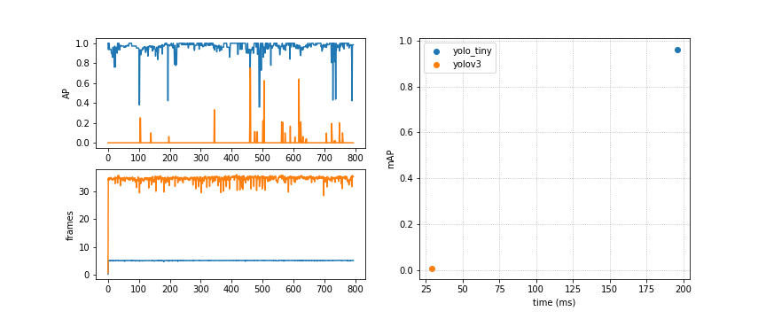

## Models
Right now the models used in this project are
    
    - yolov3
    - yolov3-tiny

here is the performance in a colab notebook using _PETS09-S2L1_ video of [MOT 2015 dataset](https://motchallenge.net/data/3D_MOT_2015/):

## Demos
Run __detect_video.py__ if you want to see the video demo or run __detect_image.py__ to see the demo on images.

## Requirements

you must download the __.weights__ file in __weights__ folder, to do that you can execute the __download_weights.py__ 

    python download_weights.py

we recommend you to use python3.7 and you must have these libraries installed

    - numpy==1.18.4
    - opencv-python==4.2.0.34
    - wget==3.2

you can also install the libraries with:

    pip install -r requirements.txt

